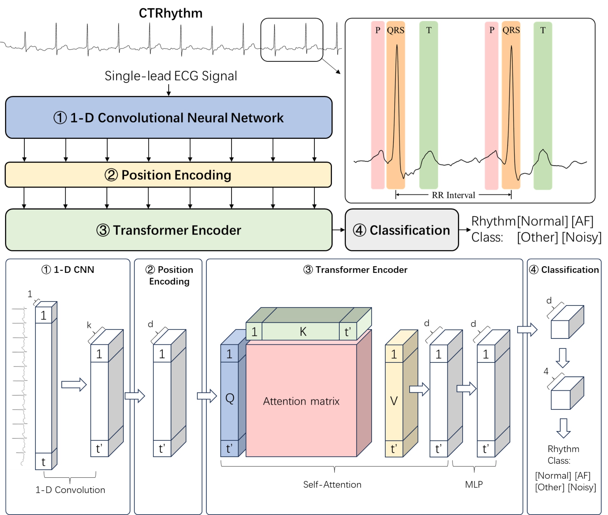

# CTRhythm: Accurate Atrial Fibrillation Detection from Single-Lead ECG Rhythm by Convolutional Neural Network and Transformer Integration

## Summary
We developed a CNN and transformer-based model, CTRhythm, for the accurate detection of AF using single-lead ECG data. We conducted cross-validation on CINC2017 and external validation on CPSC2018 and Chapman, and also explored pre-training improvements using MIMIC MIMIC-IV-ECG.

CTRhythm consists of four modules in order: 
1. 1D Convolutional Neural Network Module (1-D CNN): this module downsamples the input ECG sequence and aggregates local patterns using CNN; 
2. Position Encoding Module: this module applies positional encoding to the CNN-encoded sequence to incorporate contextual position information;
3. Transformer Encoder Module: this module performs attention-based learning of long-range dependencies using the position-CNN-encoded sequence;
4. Classification Module: this module consists of a global average pooling layer, a linear layer, and a SoftMax layer to generate prediction scores and labels.

## Data
The CINC2017 is available at: https://physionet.org/content/challenge-2017/1.0.0/
The Chapman is available at https://physionet.org/content/ecg-arrhythmia/1.0.0/ 
The CPSC2018 is available at http://2018.icbeb.org/Challenge.html
The MIMIC-IV-ECG is available at https://physionet.org/content/mimic-iv-ecg/1.0/
